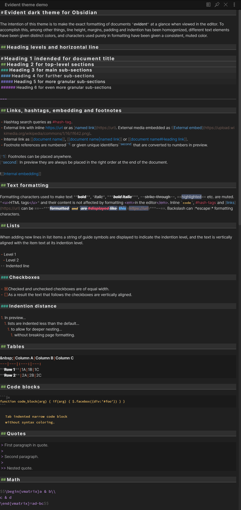
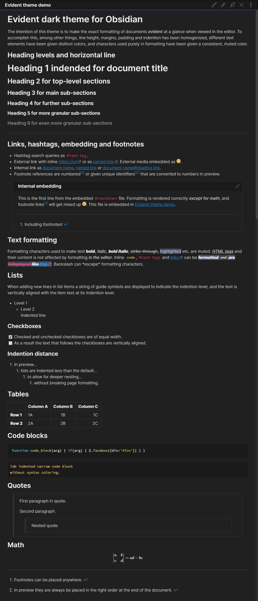
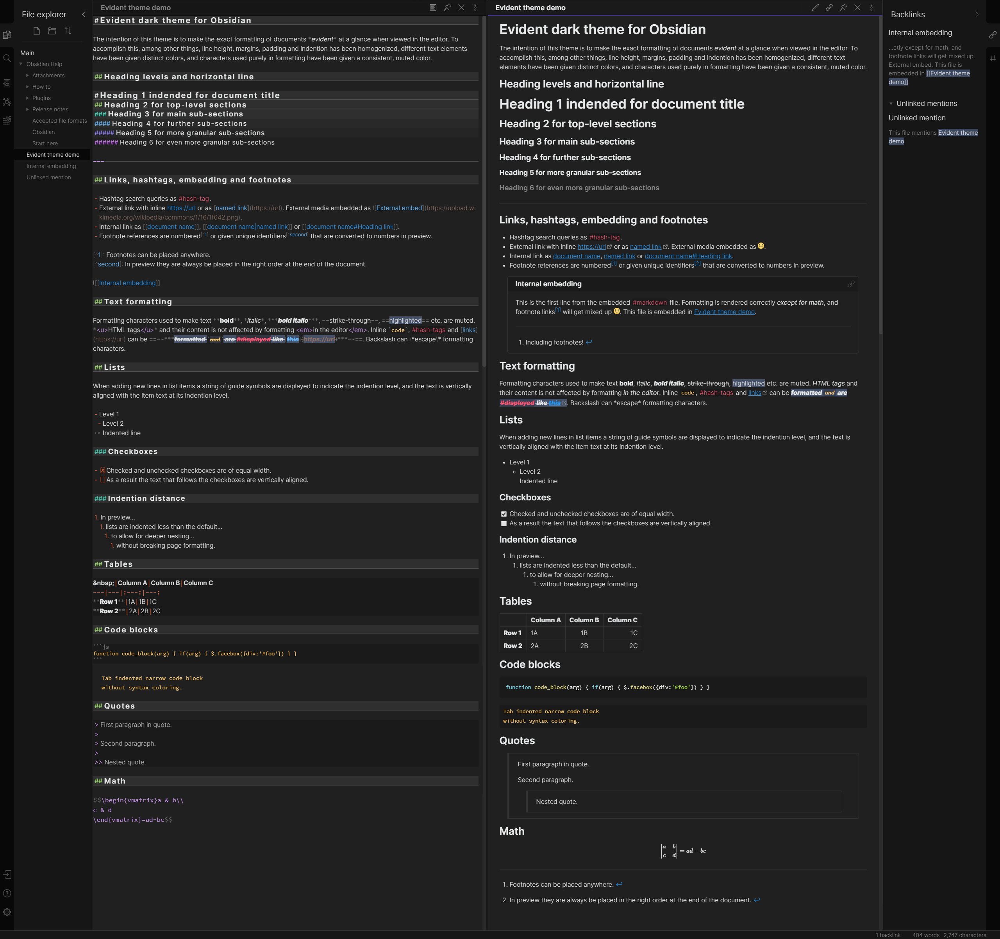

# Evident theme for Obsidian

Evident is a dark theme for [Obsidian](https://obsidian.md/). The goal of this theme is to make the exact formatting of documents *evident* at a glance when viewed in the editor. Tested with Obsidian 0.6.5.

To install download and save "obsidian.css" to your vault root folder. In Obsidian enable "Custom CSS" in Settings -> Plugins.

## Editor

## Preview

## App screenshot

